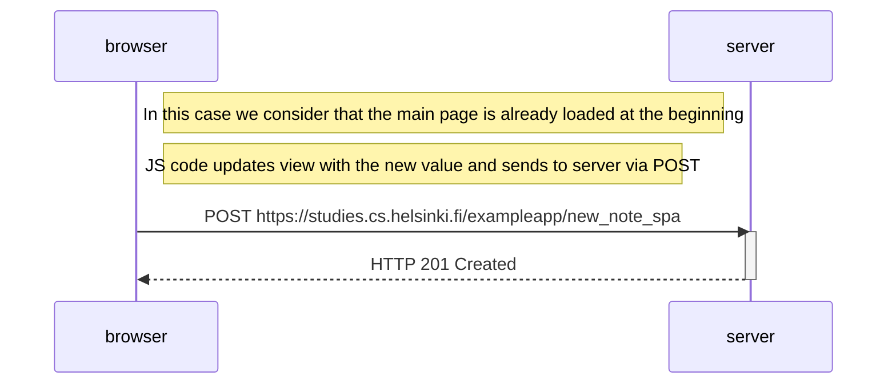

## Diagram 0.6

```mermaid
sequenceDiagram
    participant browser
    participant server

    Note right of browser: In this case we consider that the main page is already loaded at the beginning
    Note right of browser: JS code updates view with the new value and sends to server via POST

    browser->>server: POST https://studies.cs.helsinki.fi/exampleapp/new_note_spa
    activate server
    server-->>browser: HTTP 201 Created
    deactivate server
```
